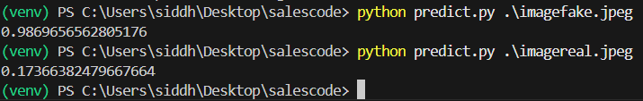
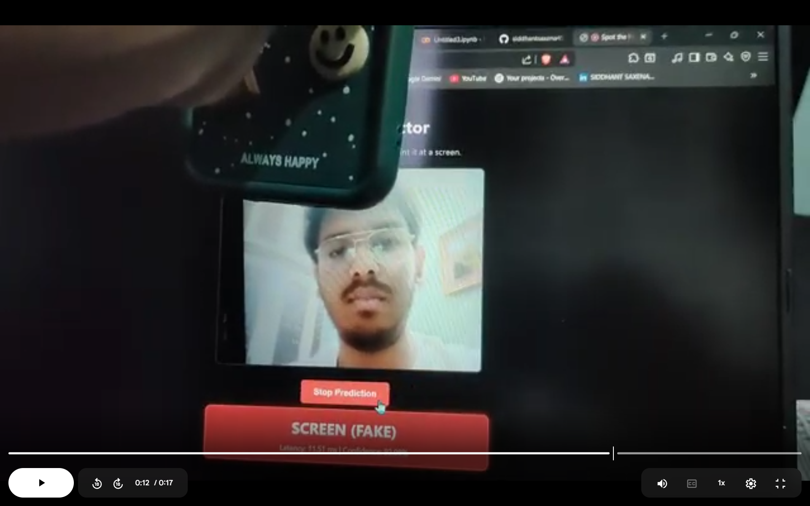
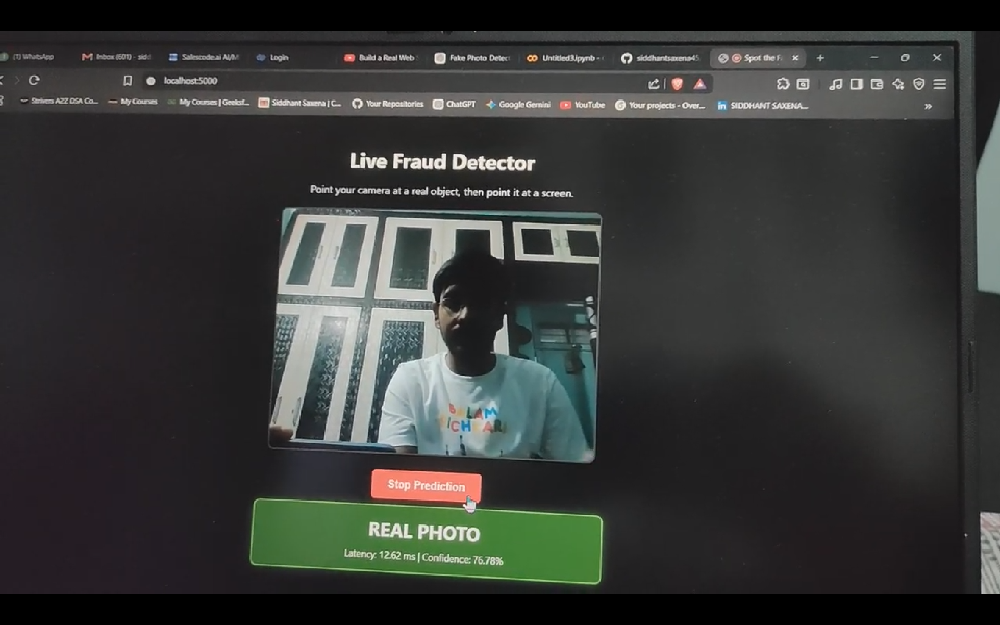

# 📸 Spot the Fake Photo (Screen Recapture Detection)





This project tackles the problem of fraud detection in a mobile app, specifically identifying when a user takes a photo of a screen (a phone or laptop showing a picture) instead of a real object. 

The task is formulated as a binary image classification problem:
* `0` = Real Photo
* `1` = Photo of a Screen (Recapture)

## 🧠 Approach & Architecture
We use a **MobileNetV3-Small** architecture, leveraging transfer learning from ImageNet. MobileNetV3-Small was specifically chosen because it is incredibly lightweight (~15MB), making it perfect for on-device mobile execution without racking up cloud computing costs.

During training, we apply aggressive data augmentations (random rotations, brightness jitter, Gaussian blur, and JPEG compression simulation) to force the model to focus on the high-frequency Moiré patterns and pixel grids native to digital screens, rather than over-indexing on lighting or colors.

## 📊 Performance Metrics (Validation Set)
The model was tested against a held-out set and achieved the following metrics:
- **Accuracy:** 93.48%
- **ROC-AUC:** 98.89%
- **Precision:** 90.48%
- **Recall:** 95.00%
- **F1 Score:** 92.68%
- **Inference Latency:** ~30-45 ms (Standard Laptop CPU)

## 🚀 Usage

### 1. Requirements
Make sure you have installed the required libraries:
```bash
pip install -r requirements.txt
```

### 2. One-line Predictor
To classify a single image, run the `predict.py` script. The script outputs a single floating-point number representing the probability of the image being a screen (fake).
```bash
python predict.py some_image.jpg
```

### 3. Live Webcam Demo (Optional & Impressive)
To see the model in action in real-time, start the lightweight Flask server:
```bash
python live_demo.py
```
Then, open your browser and navigate to `http://127.0.0.1:5000`. Point your camera at a real object, then point it at a screen to see the prediction change live!

## 📂 Repository Structure
- `predict.py` - Single image inference script.
- `live_demo.py` & `templates/index.html` - The live webcam web application.
- `best_model.pth` - The trained PyTorch model weights.
- `src/preprocess.py` - Script used to clean, crop, and deduplicate the raw dataset.
- `training notebook.ipynb` - The full training and validation pipeline used in Google Colab.
- `assignment_answers.md` - Detailed notes on latency, cost analysis, and scalability strategies.